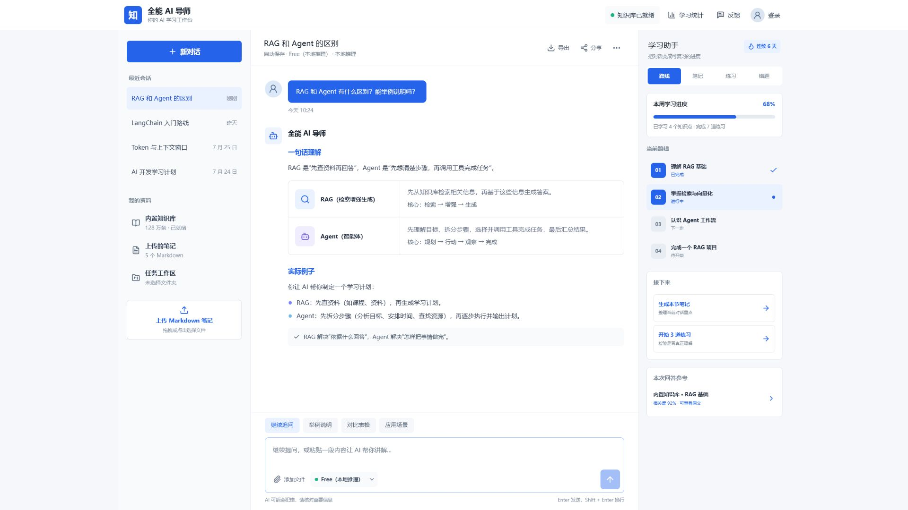

# AI 全能学习导师

一个面向 Markdown 学习资料的 AI 学习平台。系统将个人笔记构建为可检索的知识库，并提供连续问答、学习计划、练习与复习、知识管理和任务工作区。



## 主要功能

- **AI 知识问答**：结合已上传的 Markdown 资料进行检索增强问答。
- **连续对话**：按会话保留上下文，支持多轮学习交流。
- **知识库管理**：上传、查看和移除个人知识文件。
- **学习闭环**：学习计划、笔记、AI 练习、错题、复习提醒和每周总结。
- **任务工作区**：管理 Markdown 文件，并通过 AI 生成或整理内容。
- **用户与管理**：支持注册、登录、统计和管理后台。
- **模型切换**：支持 OpenAI 兼容云端 API，也可连接本机 Ollama。

## 一键启动（推荐）

### 1. 准备环境

安装并启动 [Docker Desktop](https://www.docker.com/products/docker-desktop/)。Windows 环境需要启用 WSL 2，Docker Desktop 安装程序会提供引导。

### 2. 下载项目

在 GitHub 页面选择 **Code → Download ZIP** 并解压，或者执行：

```powershell
git clone https://github.com/shuangye231/作品集.git
cd 作品集
```

### 3. 配置并启动

双击 `setup-and-start.bat`。首次启动时脚本会询问 OpenAI 兼容 API Key 和 API 服务地址，直接回车可使用默认地址。

配置仅写入本机 `.env`，不会上传 GitHub。构建完成后浏览器会自动打开 `http://localhost:8899`。

首次运行需要下载 Docker 镜像、Python 依赖和 Embedding 模型，耗时取决于网络速度。以后再次双击脚本会复用已有配置与缓存。

## 修改 API 配置

使用文本编辑器打开项目根目录的 `.env`：

```dotenv
PRO_API_KEY=填写甲方自己的APIKey
CLOUD_BASE_URL=https://api.ccode.vip/v1
```

更换 OpenAI、DeepSeek 或其他 OpenAI 兼容供应商时，应同时填写该供应商的 Key 和 Base URL。保存后执行 `docker compose up -d`。

项目不会上传 `.env`、用户数据库、上传资料或模型缓存。请勿把真实 API Key 写入源码或提交到 Git。

### 可选：使用本机 Ollama

先在宿主机启动 Ollama，并在 `.env` 中保留：

```dotenv
OLLAMA_BASE_URL=http://host.docker.internal:11434/v1
```

进入系统后切换到本地模型。仅使用 Ollama 时，`PRO_API_KEY` 可以留空。

## 常用操作

停止服务：双击 `stop.bat`，或执行 `docker compose down`。

重新启动：

```powershell
docker compose up -d
```

查看日志：

```powershell
docker compose logs -f tutor
```

检查运行状态：

```powershell
Invoke-RestMethod http://localhost:8899/api/health
```

运行数据保存在项目根目录的 `data/`，模型缓存保存在 `.hf-cache/`。停止或重建容器不会清除这两个目录。

## API 调用

FastAPI 自动接口文档位于 `http://localhost:8899/docs`。

| 方法 | 路径 | 用途 |
| --- | --- | --- |
| `GET` | `/api/health` | 服务健康检查 |
| `POST` | `/api/register` | 注册用户 |
| `POST` | `/api/login` | 用户登录 |
| `POST` | `/api/upload` | 上传 Markdown 知识文件 |
| `POST` | `/api/ask` | 发起 RAG 问答 |
| `GET` | `/api/models` | 查看可用模型 |
| `POST` | `/api/models/switch` | 切换模型 |
| `GET` | `/api/stats` | 查看知识库统计 |

健康检查示例：

```powershell
Invoke-RestMethod http://localhost:8899/api/health
```

需要登录的接口会使用登录返回的会话令牌。完整请求结构以 `/docs` 中的在线接口定义为准。

## 项目结构

```text
├─ app.py                 # FastAPI 后端与业务接口
├─ rag_engine.py          # RAG、Embedding、检索与模型调用
├─ learning_insights.py   # 学习复习与统计辅助逻辑
├─ web/                   # React 前端源码
├─ templates/             # 传统页面与管理页面
├─ static/                # 传统页面的 CSS 和 JavaScript
├─ builtin_knowledge/     # 产品内置初始知识
├─ docs/assets/           # 文档图片
├─ Dockerfile
└─ docker-compose.yml
```

## 常见问题

### 提示 Docker 未找到或未运行

确认 Docker Desktop 已安装并完成启动，再重新运行 `setup-and-start.bat`。

### 8899 端口被占用

修改 `docker-compose.yml` 中的端口映射，例如将 `8899:8899` 改为 `8900:8899`，之后访问 `http://localhost:8900`。

### AI 请求提示 Key 无效

检查 `.env` 中的 `PRO_API_KEY` 和 `CLOUD_BASE_URL` 是否来自同一个服务商，保存后执行 `docker compose up -d`。

### 首次启动很慢

首次构建会下载 PyTorch、前端依赖和多语言 Embedding 模型。下载完成后会缓存在本机，后续启动会明显加快。

## 许可

本项目采用 [MIT License](LICENSE)。
